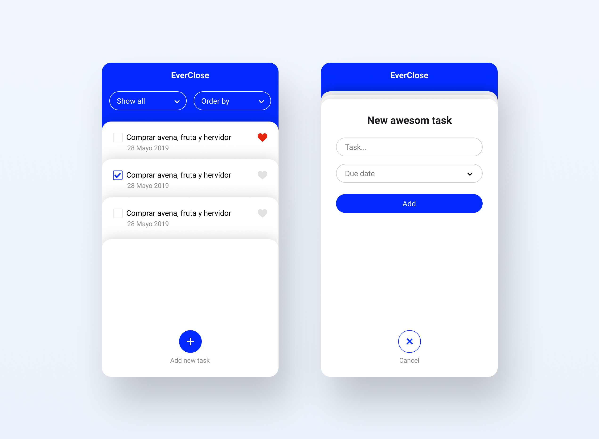

# EverClose

## What Is This?

This is a Todo List Aplication, this aplication let you:

- Create a new task with a message which has a due date.
- All the task shall to be show listed.
- The user could check a task when it will be finished.

## Team Members

- Marieth Perez
- Paul Portillo
- Deyvi Conde
- Christopher Roa

## How To Install

 1. Install live-server with the following command:
 ```
npm install -g live-server
```

2. run live-server with the following command:
```
live-server
```

## Design



